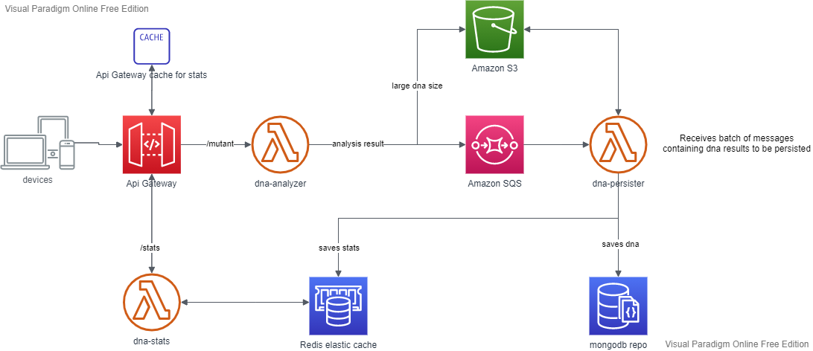

# Arquitectura de la solución

**Stack utilizado: Java + Amazon web services + MongoDB Atlas.**  
  
Para el diseño se tuvo en cuenta:  
a) Variación agresiva de tráfico (requerimiento explícito)  
Solución: funciones lambda. Desacople de la solución en 3 módulos:
- dna-analyer: encargado de analizar el adn
- dna-persister: encargado de persistir el adn 
- dna-stats: encargado de entregar las estadísticas  

b) Tamaño de los datos (requerimiento supuesto):
Tratándose de adn se buscó una implementación que permitiera lidiar con 
largas cadenas de texto. 
Se eligió una db no-sql no sólo por el poder de escalamiento sino también por la mejor 
performance a la hora de realizar búsquedas. Y particularmente MongoDB 
(en lugar de DynamoDB, por ejemplo) ya que mongo permite máximos de 16MB por collection.
Se utilizó el cliente extendido de Amazon sqs que permite enviar
mensajes de hasta 2GB valiéndose de S3 como capa de persistencia intermedia.

##Requerimientos para la ejecución local
- jdk 1.8 o superior
- maven
- docker
- aws sam cli
- mongodb

##Cómo ejecutarlo localmente
Configurar url de conección a MongoDB en el módulo *dna-integration-test*:  
*dna-integration-test/src/main/resources/app.properties*  

Ejecutar, en directorio root:  
1) *mvn clean install*  
2) *sam build*
3) *sam local start-api* 

Nota: para simplificar la ejecución en modo local no se utiliza Sqs ni S3 (*dna-analyzer* invoca directamente a *dna-persister*).  
La app crea database de nombre "dna" y dos colecciones: "mutant" y "human".  

**Acceso a los endpoints locales**
- POST http://localhost:3000/mutant
- GET http://localhost:3000/stats

  
## Instalación en AWS
Se requiere:
- endpoints en Api gateway que sean los triggers de *dna-analyzer* y *dna-stats*
- cola de mensajes sqs común que sea el trigger de *dna-persister* 
- una bucket en S3 para almacenamiento de dna extensos  

Nota: instalada en AWS el valor de las properties puede sobreescribirse si se setea una variable de ambiente del mismo
nombre. 
   
**Consideraciones por si Magneto deseara llevar esto a producción:**  
- dna-persister : la cantidad máxima de instancias debe balancearse acorde a la cantidad máxima de conecciones
                  que mongodb nos permite. Para la conección deberá setearse un idle-time adecuado 
                  ya que puede permanecer abierta luego que la instancia lambda deje de existir.  
- dna-stats : configurar caching a nivel de api-gateway con un timeout adecuado. Lo más extenso que los
requerimientos del cliente nos lo permitan (esto es, qué delay soportaría para el refresh de sus datos).
Se asumió que este delay no sería exigente (en el orden de segundos). Si la exigencia fuese mayor y el 
tráfico en este endpoint comenzara a dar problemas con las conecciones a mongo habría que pensar en desacoplar 
*dna-stats* de mongoDB, ya sea utilizando una solución de caching con persistencia, como Redis, o empleando otra base 
de datos de alto poder de escalamiento, como DynamoDB, donde *dna-persister* almacenaría exclusivamente los totales.

**Solución alternativa:**  

Otra posible mejora sería agregar un caché para los dnas repetidos, accedido por *dna-analyzer*.  