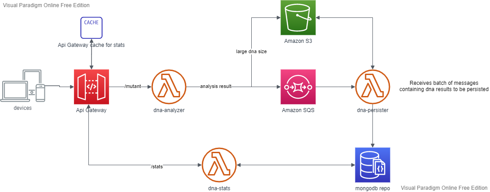

# Arquitectura de la solución

El stack utilizado es el de Amzon web services.  
Para el diseño se tuvieron en cuenta dos características:  
a) Variación agresiva de tráfico.  
Para atacar esto se utilizaron funciones lambda, desacoplando la solución en 3 módulos:
- dna-analyer: encargado de analizar el adn
- dna-persister: encargado de persistir el adn 
- dna-stats: encargado de entregar las estadísticas  

b) Tamaño de los datos.
Tratándose de adn se buscó una implementación que permitiera lidiar con 
largas cadenas de texto. MongoDB permite máximos de X. Amazon sqs extendida permite enviar
mensajes de hasta X mb, usando S3 como persistencia intermedia.

Requerimientos para la ejecución local:
- jdk 8 o superior
- maven
- docker
- aws sam cli
- mongodb

Configuración:
- configurar properties en el módulo **dna-integration-test**:  
 
Archivo: *dna-integration-test/resources/app.properties*  
Property: *mongodb_url*  

Nota: la app por defecto creará databse de nombre "dna" y dos colecciones: "mutant" y "human".
El nombre de la database es configurable, así como también el largo de la secuencia que determina un mutante 
(*mutant_seq_size*) y la cantidad de veces que dicha secuencia debe repetirse
(*mutant_seq_count*).
El valor de cada property puede sobreescribirse si se setea una variable de ambiente del mismo
nombre.

Pasos previos a la ejecución
- Instalar artefactos maven: *mvn clean install*  
- Realizar sam build: *sam build*

Ejecución: *sam local start-api* 

Acceso a los endpoints locales:
- POST http://localhost:3000/mutant
- GET http://localhost:3000/stats

NOTA: para facilitar la ejecución local no se utiliza sqs ni S3 (dna-analyzer invoca directamente a dna-persister). 

La aplicación está instalada en AWS. 
Endpoints remotos:
- https://0t4g1eo04d.execute-api.us-east-1.amazonaws.com/test/stats
- https://0ytar4ltb4.execute-api.us-east-1.amazonaws.com/test/mutant

Consideraciones para la instalación en AWS:  
- dna-analyzer : tener cierto mínimo de instancias activas
- dna-persister : la cantidad de instancias no debe ser superior a la cantidad máxima de conecciones
                  que permite mongodb. debido a que luego de conectarse a mongo mantiene la conección 
                  abierta, para cada conección debe setear un máximo de idle-time adecuado (por las conecciones
                  que quedarán abiertas una vez que la instancia lambda deje de existir).  
- dna-stats : configurar de caching a nivel de api-gateway, con un timeout lo más grande posible dependiendo de
los requerimientos del cliente (qué delay se banca Magneto para el refresh de sus datos).
Se asumió que este delay no sería exigente (en el orden de segundos).
Si Magneto fuera muy exigente al respecto y el tráfico en este endpoint comenzara a dar problemas con las
conecciones a mongodb habría que pensar en desacoplar dna-stats de la base de datos, ya sea usando una
solución de caching como Redis, o utilizando otra base de datos de alto poder de escalamiento, como DynamoDB.

Solución alternativa:  

